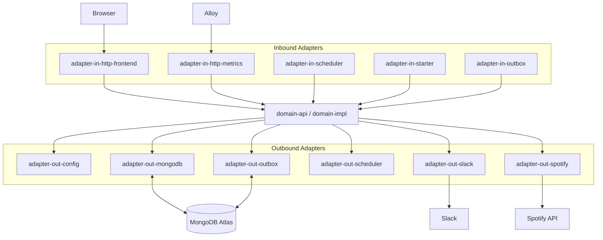
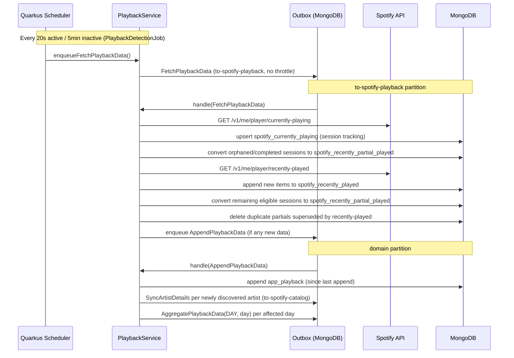
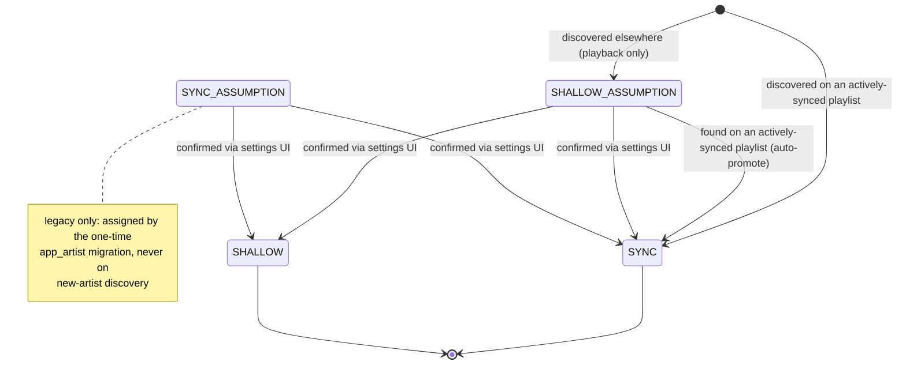
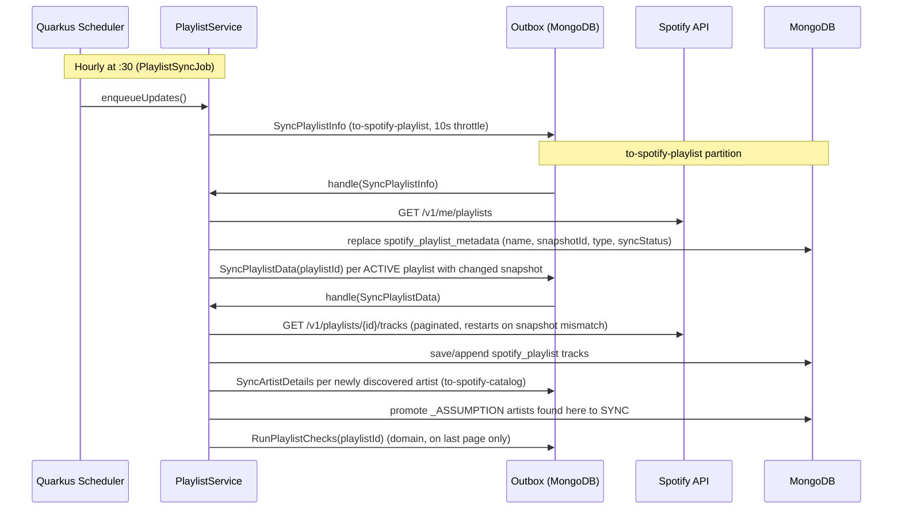
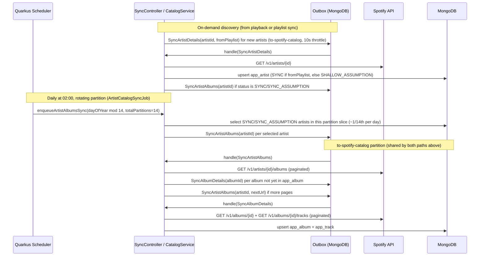
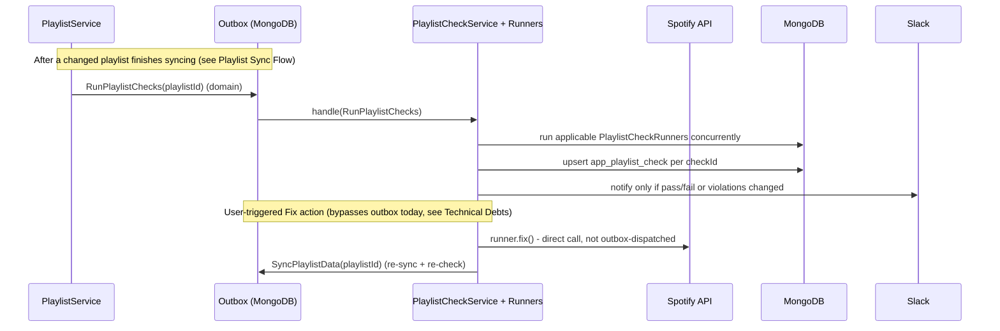
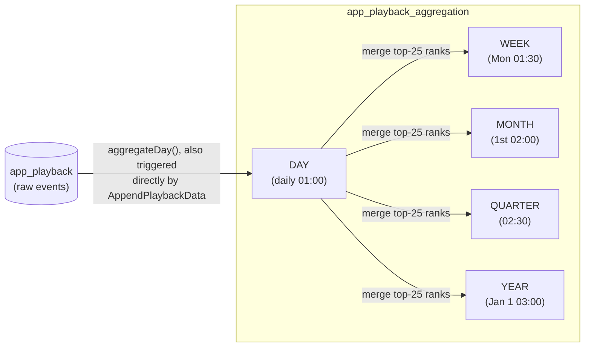
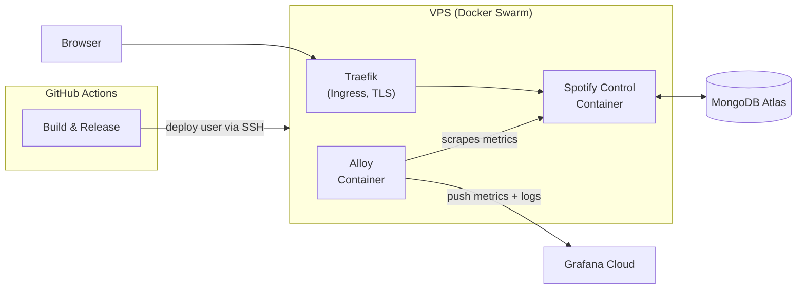

# spotify-control

# Introduction and Goals

## Requirements Overview

spotify-control is a private Spotify playlist manager built for exactly one user. There is no
registration, no allow-list, and no user-management UI — any Spotify account that completes the
OAuth login flow becomes the application's user, and a different account cannot log in once one is
registered.

**Implemented features:**

1. **Playback Tracking** – Spotify `currently-playing` and `recently-played` are polled and stored, with the poll frequency driven by whether playback is currently active. Partial plays (tracks not played to completion) are detected via observation sessions and stored separately.

2. **Playlist Mirror** – Local copy of selected Spotify playlists. Sync is driven by snapshot IDs – a full track sync is only performed when Spotify reports a change.

3. **Catalog Sync** – Artist images, track album references, and album details (title, cover) are fetched from the Spotify API and stored locally, deduplicated across artists, tracks and albums.

4. **Listening Statistics** – Playback data is aggregated into a dashboard showing total play counts, daily play trends, top artists, top tracks, and recently played items.

5. **Shallow Artists** – Artists can be confirmed as `SYNC` (full catalog sync) or `SHALLOW` (artist metadata only, no albums/tracks); a newly discovered artist starts with a guessed status pending user confirmation via the settings UI. Playback of `SHALLOW` artists is still recorded but excluded from statistics.

6. **Playlist Checks** – A set of pluggable rule checks runs against every actively-synced playlist after each sync, with results and available fixes shown on a dashboard.

## Quality Goals

| Priority | Goal | Description |
|----------|------|--------------|
| 1 | **Resilience against Spotify rate limits** | Spotify's rate limits are strict and partly undocumented, and are most likely to be hit during larger catalog or playlist syncs. The application must throttle proactively and recover automatically from `429` responses without data loss or manual intervention. |
| 2 | **Efficient Spotify API usage** | Every sync path favours the minimum number of Spotify API calls needed for the data that actually changed, rather than broad or repeated fetching. |
| 3 | **Good performance** | The UI and background sync stay responsive as the local catalog and playback history grow. |
| 4 | **Simple, uncluttered UI** | The web UI favours a small number of clear, task-focused pages over configurability or visual complexity. |

# Architecture Constraints

- **Single user** – The application is built for exactly one user. No registration, no user-management UI, no allow-list.
- **Login exclusively via Spotify OAuth** – No other authentication mechanism.
- **External MongoDB** – Data is stored in MongoDB Atlas (two projects: prod + dev). No self-hosted database.
- **VPS with Docker Swarm** – Deployment target is an existing VPS running Docker Swarm with Traefik for routing and TLS.
- **No separate frontend project** – Server-side rendering via Quarkus Qute; no React, Vue, npm, Node.js, or build steps.
- **Async work via Outbox** – The rule is that all asynchronous work goes through the persistent outbox – not only Spotify calls (other than the OAuth login token exchange), but domain-level operations as well – rather than being triggered directly from `domain-impl`/`adapter-in-*`. This is not yet fully consistent in practice – see Risks and Technical Debts.
- **Proactive Spotify throttling** – Spotify-facing outbox partitions are throttled at a fixed interval on our side rather than relying solely on reacting to `429` responses – see Cross-cutting Concepts → Outbox Pattern.

# Context and Scope

## Business Context

spotify-control interacts with the following external systems. Direction reflects who initiates
contact, not just who reads/writes data – Spotify and MongoDB Atlas never call the application back,
so only the browser is genuinely bidirectional:

<dl>
  <dt>Spotify API</dt>
  <dd><strong>Outbound.</strong> Read/write playback, playlists, artists, albums via REST; OAuth 2.0 login.</dd>

  <dt>MongoDB Atlas</dt>
  <dd><strong>Outbound.</strong> Persistent storage for all domain data (tracks, playlists, events, etc.).</dd>

  <dt>User (Browser)</dt>
  <dd><strong>Bidirectional.</strong> Web UI for dashboard, settings, and documentation; the browser sends requests, and the server also pushes live updates to it via Server-Sent Events.</dd>

  <dt>Slack</dt>
  <dd><strong>Outbound.</strong> System, catalog and playlist-check notifications via incoming webhook.</dd>
</dl>

## Technical Context

The technical channels that carry the interactions from Business Context, plus the internal
mechanisms that connect them to the domain:

<dl>
  <dt>Spotify API</dt>
  <dd>REST via <code>adapter-out-spotify</code>, OAuth 2.0 Authorization Code Flow with token refresh. All calls are dispatched through the persistent outbox rather than issued directly from the domain.</dd>

  <dt>MongoDB Atlas</dt>
  <dd>MongoDB driver via <code>adapter-out-mongodb</code>; the only persistence mechanism used, no separate cache tier.</dd>

  <dt>Web UI</dt>
  <dd>Quarkus Qute SSR, vanilla JS (fetch API) and Bootstrap 5 for the request/response side; Server-Sent Events for server-initiated push.</dd>

  <dt>Scheduled jobs</dt>
  <dd>Quarkus scheduler; triggers the periodic domain actions (playback polling, playlist/catalog sync, aggregation) described in Runtime View.</dd>

  <dt>Internal event bus</dt>
  <dd>CDI Events (in-process); used for notifications that don't need outbox durability, e.g. triggering SSE pushes.</dd>

  <dt>Async task queue</dt>
  <dd>Persistent Outbox (<code>de.chrgroth.quarkus.outbox</code>); the backbone for reliable, throttled, rate-limit-aware dispatch – see Cross-cutting Concepts → Outbox Pattern.</dd>

  <dt>Slack</dt>
  <dd>REST POST via <code>adapter-out-slack</code> to a configured incoming webhook.</dd>
</dl>

# Solution Strategy

- **Hexagonal Architecture** – The application is structured using hexagonal (ports and adapters) architecture to cleanly separate domain logic from infrastructure concerns.
- **Outbox Pattern** – Spotify API operations and domain-level async work are routed through a persistent outbox to ensure reliability and rate limit handling, decoupling producers from consumers.
- **Functional Error Handling** – Domain failures are represented as typed `DomainError` values wrapped in Arrow's `Either<DomainError, T>` instead of exceptions, keeping error paths explicit at every port boundary – see Cross-cutting Concepts → Error Handling.
- **Test Your Boundaries** – Tests target port boundaries (domain logic, outbound adapters, inbound HTTP contracts) rather than chasing line coverage – see Cross-cutting Concepts → Testing Strategy.
- **Server-Side Rendering** – The frontend uses Quarkus Qute templates with vanilla JS (fetch API) for dynamic interactions, eliminating the need for a separate frontend project or JavaScript framework.
- **Single-User System** – The application is built for exactly one user, logging in via Spotify OAuth. No allow-list, no self-service registration, no user-management UI.

# Building Block View

## Whitebox Overall System

The system is composed of the following Gradle modules:

| Module                  | Role                                                                              |
|-------------------------|-------------------------------------------------------------------------------------|
| `adapter-in-http-frontend` | REST endpoints, OAuth callback, SSE endpoints, and action endpoints for the Qute-rendered web UI |
| `adapter-in-http-metrics`  | HTTP response timing/slow-response and application/playlist/catalog/outbox/MongoDB gauge metrics via Micrometer, wired independently from the frontend via CDI |
| `adapter-in-outbox`     | Outbox event dispatcher – routes outbox events to the correct domain port handler; pauses a partition on `SpotifyRateLimitError` |
| `adapter-in-scheduler`  | Scheduled jobs for polling Spotify and syncing data; all jobs skip execution until starters have completed |
| `adapter-in-starter`    | One-time startup bean implementations for data migrations, schema changes and bugfixes; each runs exactly once in production |
| `adapter-out-config`    | Reads MicroProfile config/env vars and masks sensitive keys for the `/config` health page |
| `adapter-out-mongodb`   | Repository implementations for MongoDB, including encrypted token storage and all domain collections |
| `adapter-out-outbox`    | Outbox adapter for writing new tasks into the outbox                              |
| `adapter-out-scheduler` | Scheduler info provider for the health page                                       |
| `adapter-out-slack`     | Slack notification adapter for system, catalog and playlist-check notifications via incoming webhook |
| `adapter-out-spotify`   | Spotify API client, token refresh, fixed-interval throttling, rate-limit backoff; all endpoints operate on a single entity per call |
| `application-quarkus`   | Quarkus application bundling, configuration, and integration tests (`@QuarkusTest`) |
| `domain-api`            | Ports (interfaces), domain models, and outbox event/partition types – defines the contracts between domain and adapters |
| `domain-impl`           | Domain services and business logic                                                |



### External Dependencies

#### `de.chrgroth.quarkus.outbox`

Provided via [christiangroth/quarkus-outbox](https://github.com/christiangroth/quarkus-outbox) (GitHub Packages). Five artifacts:

- `domain-api` – outbox contracts: `OutboxPartition`, `OutboxEvent`, `OutboxTaskDispatcher`, `OutboxTaskResult`, `RetryPolicy`, and associated types
- `domain-impl` – Quarkus implementation: `OutboxImpl`, `OutboxProcessor`, `OutboxWakeupService`, `OutboxStartupRecovery`, `OutboxPartitionWorker`
- `adapter-out-persistence-mongodb` – MongoDB persistence: at-least-once delivery, atomic claim, partition-level pause/resume, task deduplication, priority ordering
- `adapter-in-scheduler` – scheduler-side wiring for outbox wakeup/backlog handling
- `adapter-out-executor` – task execution

#### `de.chrgroth.quarkus.starters`

Provided via [christiangroth/quarkus-one-time-starters](https://github.com/christiangroth/quarkus-one-time-starters) (GitHub Packages). Three artifacts:

- `domain-api` – contracts: `Starter`, `StarterSkipPredicate`, `StarterCompletionFlag`
- `domain-impl` – execution orchestration and startup observer
- `adapter-out-persistence-mongodb` – MongoDB persistence for starter execution state

A third self-authored GitHub Packages artifact, `de.chrgroth.gradle.release-notes`, exists but is a
build-time-only Gradle plugin (not a runtime library) — see Deployment View → Release Process.

# Runtime View

## Playback Flow

`PlaybackDetectionJob` enqueues a single `FetchPlaybackData` event on the `to-spotify-playback`
partition. Its effective schedule is driven by `CurrentlyPlayingSkipPredicate`: every 20 seconds
while playback is active, falling back to every 5 minutes while inactive. Its handler fetches both
currently-playing and recently-played data in one pass — there is no separate 10-minute schedule.



Session tracking distinguishes a still-active listening session (protected from conversion) from
sessions eligible for conversion into a partial play once observed progress exceeds the configured
minimum (default 25s); converted sessions move to `spotify_recently_partial_played`. A partial play
later superseded by a matching `recently-played` entry is deleted again, together with any
already-appended `app_playback` entry, and the affected day is re-aggregated.

`AppendPlaybackData` (enqueued whenever new raw data arrives) appends new entries to `app_playback`,
enqueues `AggregatePlaybackData(DAY, day)` per affected day, and triggers on-demand catalog discovery
(`SyncController.syncForTracks()`, see [Catalog Sync Flow](#catalog-sync-flow)) for any newly-seen
artist. A user-triggered **Rebuild** (Settings) deletes all `app_playback` entries and re-runs this
from scratch over all source data.

## Artist Sync Status

The catalog settings pages (`/catalog/artists/settings` for undecided artists, the Catalog UI for
confirmed ones) let users control how much of an artist's catalog is synced via `app_artist.syncStatus`
(`ArtistSyncStatus`). `SYNC` and `SHALLOW` are final: `SYNC` performs a full catalog sync (albums,
tracks) and includes the artist in aggregation/statistics, while `SHALLOW` syncs only the artist
document (deleting any existing albums/tracks whose main artist is this artist) and excludes its
playback from aggregation without deleting it. `SYNC_ASSUMPTION`/`SHALLOW_ASSUMPTION` are unconfirmed
guesses that behave like their final counterpart until the user decides; `SYNC_ASSUMPTION` is no
longer assigned on new-artist discovery and only remains from the one-time `app_artist` migration.



- Only the main artist (first artist in the Spotify artist list) determines sync scope and deletion
  on transition to `SHALLOW`; secondary/featured artists are unaffected.
- Playback events are never deleted based on artist status; `PlaybackAggregationService.aggregateDay()`
  filters `SHALLOW`/`SHALLOW_ASSUMPTION` artists out at aggregation time instead, and a status change
  triggers `rebuildAllAggregations()`.
- The daily rotating catalog resync (see [Catalog Sync Flow](#catalog-sync-flow)) only re-enqueues
  album sync for `SYNC`/`SYNC_ASSUMPTION` artists.

## Playlist Sync Flow

Hourly (at :30), the app compares Spotify's playlist snapshot IDs against the locally stored ones and
only re-syncs playlists that actually changed. Newly discovered artists feed into the same on-demand
catalog discovery as playback (`SyncController.syncForTracks()`), and the last synced page enqueues a
[playlist checks](#playlist-checks-flow) run.



## Catalog Sync Flow

All catalog sync calls are single-entity (`GET /v1/artists/{id}`, `GET /v1/artists/{id}/albums`,
`GET /v1/albums/{id}`) — there is no bulk multi-ID sync. Two independent paths feed into the same
`to-spotify-catalog` partition: on-demand discovery from playback/playlist sync, and a daily job that
rotates through 1/14th of all syncable artists so a full resync is spread across two weeks instead of
happening all at once.



## Playlist Checks Flow

`RunPlaylistChecks` is purely outbox/event-driven — never triggered directly by a scheduler job. All
CDI-discovered `PlaylistCheckRunner` beans applicable to a playlist's type (some checks are scoped to
`SINGULARITY` or `YEAR` playlists only) run concurrently; a Slack notification fires only when a
check's pass/fail state or its violation list changes. The "Fix" action calls Spotify directly rather
than through the outbox — see Risks and Technical Debts.



## Playback Aggregation Flow

Statistics are served from precomputed aggregations rather than scanning raw `app_playback` data on
every read, in a two-tier rollup: `DAY` is computed from raw playback data, and `WEEK`/`MONTH`/
`QUARTER`/`YEAR` are each computed directly from the `DAY` tier (not chained through each other).
Only the top 25 rank entries are kept per rolled-up period to keep documents small.



`AppendPlaybackData` also directly enqueues `DAY` aggregation for any day whose raw data just changed,
independent of the daily job. `rebuildAllAggregations()` deletes and fully re-enqueues all five tiers
when historical data changes (e.g. an artist's sync status flips).

# Deployment View

spotify-control runs as a single Docker Swarm service on an existing VPS, reachable only through
Traefik as the ingress (routing, TLS termination via Let's Encrypt). A dedicated Alloy container runs
alongside it on the same VPS, scraping `adapter-in-http-metrics` and collecting container logs, and
forwarding both to Grafana Cloud. MongoDB is not self-hosted – both the production and development
databases live in MongoDB Atlas. The GitHub Actions workflow builds the Quarkus native Docker image
and, on release, connects to the VPS via SSH as a dedicated deploy user to roll out the updated Docker
Swarm stack. Secrets (Spotify credentials, MongoDB connection string, token encryption key, Slack
webhook URL) are never stored in deployment configuration – they are provided via environment
variables from a `.env` file on the VPS that is not checked into Git.



## Release Process

- **Release plugin** – `net.researchgate.release` manages version bumping and Git tagging
- **Release-Notes plugin** – custom Gradle plugin (`de.chrgroth.gradle.plugins.release-notes`) maintained in https://github.com/christiangroth/gradle-release-notes-plugin
- **CI/CD** – the GitHub Actions workflow (`gradle.yml`) runs `./gradlew build` on every push; runs `./gradlew release` only on pushes to `main`; after release, the Docker stack file is copied to the VPS via SCP and the stack is deployed via SSH. All secrets (including `SLACK_WEBHOOK_URL`) must be configured as GitHub Actions repository secrets.
- **Snippet requirement** – every branch that is not `main` or `dependabot/*` **must** contain at least one release note snippet in `docs/releasenotes/snippets/`; the build fails without it. Create snippets with the corresponding Gradle tasks (`releasenotesCreateFeature`, `releasenotesCreateBugfix`, …); filenames follow the pattern `{branch-last-segment}-{type}.md`

## Spotify OAuth Redirect URIs

Both URIs must be registered in the Spotify Developer App (replace `spotify.yourdomain.com` with the actual production domain):

```
https://spotify.yourdomain.com/oauth/callback   ← Production
http://localhost:8080/oauth/callback             ← Local development
```

# Cross-cutting Concepts

## Testing Strategy

Tests follow the *Test Your Boundaries* principle mapped to the hexagonal architecture:

| Layer | Entry point | Test doubles | Module | Framework |
|-------|-------------|--------------|--------|-----------|
| 1 – Domain logic | Inbound port (`*Port` in `domain-api`) | MockK mocks for all outbound ports | `domain-impl` | JUnit 5 + MockK |
| 2 – Outbound adapters | Outbound port interface | None – real infra (MongoDB dev-service, Spotify mock) | `application-quarkus` | `@QuarkusTest` |
| 3 – Inbound adapters | HTTP endpoint / scheduler `run()` | CDI mocks via `@InjectMock` | `application-quarkus` | `@QuarkusTest` + REST Assured |
| 4 – App wiring | Health/metrics endpoints | None | `application-quarkus` | `@QuarkusTest` |
| 5 – Adapter-local logic | Class under test | MockK mocks | individual adapter module | JUnit 5 + MockK |

Layer 5 applies to adapter modules where the logic is pure (e.g. `adapter-in-starter`, `adapter-out-scheduler`).

## Authentication and Access Control

- Spotify OAuth 2.0 Authorization Code Flow.
- A `User` document is upserted in the `app_user` MongoDB collection on every successful login. Both access and refresh tokens are stored encrypted (AES-256-GCM) using `APP_TOKEN_ENCRYPTION_KEY`.
- The application is built for a single user; login does not check an allow-list — any Spotify account that completes the OAuth flow is upserted as the application's user. A different Spotify account cannot log in once one user is already registered.
- Scheduled jobs, catalog sync, and every repository port act directly on the one stored user instead of fanning out over or filtering by a user list. MongoDB collections do not carry a `spotifyUserId` field or key, since only one user can ever exist.
- Session-based authentication for all endpoints. The session stores only the Spotify user ID – never tokens.
- `return_to` parameter stored in the session for redirect after login.
- A CSRF `state` parameter is generated per authorization request and validated in the callback.
- Token refresh is handled by `adapter-out-spotify` before each Spotify API call; the refreshed token is persisted back to MongoDB.

## Error Handling

All domain failures are represented as typed `DomainError` values wrapped in Arrow's `Either<DomainError, T>`.

- Port interfaces return `Either<DomainError, T>` instead of raw domain objects or throwing exceptions.
- Infrastructure adapters (`adapter-out-*`) catch all exceptions at the adapter boundary and convert them to typed `Either.Left<DomainError>` values – no exceptions cross port boundaries.
- Domain services compose multiple fallible operations using the Arrow `either { }` DSL with `bind()`.
- Web adapters translate `Either.Left<DomainError>` to HTTP error responses (redirect with `?error=<code>`).
- Error codes follow the convention `<AREA>-<NNN>` (e.g. `AUTH-001`). Codes are stable once published.

## Outbox Pattern

Spotify API operations and domain-level async tasks are routed through a persistent outbox where
possible (see Architecture Constraints for known gaps). This ensures reliability and decouples
producers from consumers.

**Partitions and event types:**

| Partition             | Throttle | Rate-limit pause | Event Types                                                                 |
|------------------------|----------|-------------------|-------------------------------------------------------------------------------|
| `to-spotify-catalog`  | 10s (shared, runtime-adjustable) | yes | `SyncArtistDetails`, `SyncArtistAlbums`, `SyncAlbumDetails` |
| `to-spotify-playlist` | 10s (shared, runtime-adjustable) | yes | `SyncPlaylistInfo`, `SyncPlaylistData`, `FixPlaylistCheck`   |
| `to-spotify-user`     | none     | yes               | `UpdateUserProfile`                                                          |
| `to-spotify-playback` | none     | yes               | `FetchPlaybackData`                                                          |
| `domain`              | none     | n/a (no Spotify calls) | `RebuildPlaybackData`, `AppendPlaybackData`, `ResyncCatalog`, `WipeCatalog`, `RunPlaylistChecks`, `AggregatePlaybackData`, `ConfirmArtistSync`, `ConfirmArtistShallow` |

`to-spotify-catalog` and `to-spotify-playlist` share one runtime-adjustable throttle interval
(`spotify.throttle.default-interval-ms`, default 10s) — there is no per-partition distinct value.
Rate-limit pause is not a per-partition configuration switch: any domain operation that returns a
`SpotifyRateLimitError` (any handler that calls Spotify, regardless of partition) pauses that
event's partition until the `Retry-After` duration has elapsed.

Successfully processed events are moved to `outbox_archive` (audit log). Internal triggers between services use CDI events (not the outbox).

## Server-Sent Events (SSE) and Live Updates

Backend services notify SSE streams via CDI events. The SSE endpoint delivers the initial state on connect, then pushes named update events to connected clients via a single shared reactive stream — there is only ever one possible subscriber, so `DashboardSseAdapter` holds one emitter list rather than a per-user map.

## Scheduler Jobs

| Job                          | Interval                                | Outbox Event(s)                              |
|------------------------------|-------------------------------------------|-----------------------------------------------|
| `PlaybackDetectionJob`       | every 20s (playback active) / 5min (inactive) | `FetchPlaybackData` → auto-enqueues `AppendPlaybackData` |
| `PlaylistSyncJob`            | hourly (at :30)                           | `SyncPlaylistInfo`                            |
| `ArtistCatalogSyncJob`       | daily at 02:00 (rotating 1/14 partition)  | `SyncArtistAlbums`                            |
| `UserProfileUpdateJob`       | daily at 04:00                            | `UpdateUserProfile`                           |
| `PlaybackAggregationJob`     | daily 01:00 / weekly Mon 01:30 / monthly 1st 02:00 / quarterly 02:30 / yearly Jan 1 03:00 | `AggregatePlaybackData` (one per period type) |

All scheduler jobs skip execution via `skipExecutionIf = ScheduledSkipPredicate::class` (from `de.chrgroth.quarkus.starters`) until all starters have completed successfully.

## Starters

One-time startup beans for data migrations, schema changes, and one-time bugfixes. Each starter executes exactly once in `NORMAL` (prod) mode; failed starters are retried on the next application start. The Quarkus scheduler is blocked until all starters succeed.

## Frontend Approach

No separate frontend project. The UI is rendered server-side using Quarkus Qute templates. Dynamic interactions are handled via vanilla JS with the fetch API. No React, Vue, npm, Node.js, or build steps are required.

**Technology stack:**
- Templates: Qute (Quarkus SSR)
- CSS: Bootstrap 5 via WebJar
- Interactivity: Vanilla JS (fetch API)
- Icons: hand-authored inline SVG `<symbol>` sprite defined in `layout.html`, referenced via `<use href="#icon-...">` — no icon-font dependency
- Live Updates: Server-Sent Events via native `EventSource` API
- Markdown rendering: marked via WebJar (docs and release notes pages)
- Diagram rendering: Mermaid via WebJar (Docs page only; GitHub renders the same ` ```mermaid ` blocks natively)

## Documentation and Release Notes Serving

Architecture documentation (`docs/arc42`), ADRs (`docs/adr`), and release notes (`docs/releasenotes`) are served to the logged-in user directly from the application. A Gradle copy task bundles the Markdown files into the `adapter-in-http-frontend` classpath at build time. A `DocsResource` endpoint reads and passes the raw Markdown to Qute templates; the `marked` WebJar renders it in the browser. Diagrams are authored as ` ```mermaid ` fenced code blocks — rendered natively by GitHub, and rendered in-app on the Docs page by the `mermaid` WebJar, which `docs.html` runs against `marked`'s unrecognised-language code-block output after parsing.

# Architecture Decisions

- [0001](../adr/0001-using-arc42-as-project-documentation.md) – Using arc42 as Project Documentation
- [0002](../adr/0002-backend-hexagonal-architecture.md) – Backend: Hexagonal Architecture
- [0003](../adr/0003-no-separate-frontend-project.md) – No Separate Frontend Project
- [0004](../adr/0004-using-ai-coding-agents.md) – Using AI Coding Agents
- [0005](../adr/0005-markdown-rendering-library.md) – Markdown Rendering Library: marked
- [0006](../adr/0006-error-handling-concept.md) – Error Handling: Arrow Either&lt;DomainError, T&gt;
- [0007](../adr/0007-persistent-outbox-pattern.md) – Persistent Outbox for Spotify API Operations
- [0008](../adr/0008-single-user-architecture.md) – Single-User Architecture
- [0009](../adr/0009-shallow-artist-catalog-sync-model.md) – Shallow Artist Catalog Sync Model
- [0010](../adr/0010-partial-play-detection-via-currently-playing-polling.md) – Partial Play Detection via Currently-Playing Polling
- [0011](../adr/0011-playlist-checks-framework.md) – Playlist Checks Framework
- [0012](../adr/0012-diagram-rendering-mermaid.md) – Diagram Rendering: Mermaid

# Quality Requirements

## Quality Requirements Overview

| ID  | Quality Goal              | Priority | Description |
|-----|--------------------------|----------|-------------|
| Q1  | Domain Purity            | High     | The domain (`domain-api`, `domain-impl`) has zero compile-time dependencies on infrastructure frameworks (Quarkus, MongoDB, Spotify SDK), with the exception of CDI and MicroProfile Config which are permitted in `domain-impl` service classes. Domain model classes are plain Kotlin data classes. |
| Q2  | Boundary Correctness     | High     | All communication between domain and adapters goes through port interfaces. No adapter type leaks into domain objects. No business logic lives in adapter classes. |
| Q3  | Outbox Reliability       | High     | Spotify API calls dispatched through the persistent outbox get rate-limit handling and at-least-once delivery guaranteed by the outbox implementation. |
| Q4  | Functional Test Confidence | Medium | The test suite covers the inbound port boundary (domain logic), outbound adapter round-trips (MongoDB), and inbound HTTP contracts. Line coverage is a by-product, not a goal. |
| Q5  | Maintainability          | Medium   | Any developer familiar with hexagonal architecture can understand and safely change the system. Module naming, port contracts, and architecture decision records provide the context. |
| Q6  | Operational Stability    | Medium   | The application handles Spotify rate limits, token expiry, and partial data gracefully without requiring manual intervention. |

## Quality Scenarios

| ID  | Scenario | Expected Behaviour |
|-----|----------|--------------------|
| Q1-S1 | A developer adds a MongoDB `Document` field to a domain model class | The build fails – domain model classes must not carry infrastructure types |
| Q2-S1 | A developer adds a direct Spotify HTTP call inside `domain-impl` | The build fails – `adapter-out-spotify` is not in the compile classpath of `domain-impl` |
| Q3-S1 | A `to-spotify-*` outbox partition receives a 429 response | The partition stops dispatching; a Slack notification is sent; tasks resume automatically once the `Retry-After` duration elapses |
| Q4-S1 | A developer changes the payload structure of `SyncPlaylistData` | The contract test fails before the change can be merged |
| Q4-S2 | A developer adds a new business rule to `PlaylistAdapter` | A domain logic test (Layer 1) is added that calls through `PlaylistPort` and verifies the rule using mocked outbound ports |
| Q5-S1 | A developer needs to replace MongoDB with a different database | Only `adapter-out-mongodb` needs to change; domain and all other adapters are unaffected |

# Risks and Technical Debts

## Risks

| Risk | Probability | Impact | Mitigation |
|------|-------------|--------|------------|
| Spotify API breaking changes | Medium | High | No versioned Spotify SDK; changes require adapter updates. Monitor Spotify changelog. |
| Spotify API rate limiting | High | Medium | `to-spotify-catalog`/`to-spotify-playlist` partitions throttle at 10s per request; any partition pauses on a 429 until `Retry-After` elapses. |
| Token encryption key loss | Low | High | If `APP_TOKEN_ENCRYPTION_KEY` is lost, all stored tokens are invalid and users must re-authenticate. Key must be backed up securely. |
| MongoDB Atlas outage | Low | High | No local fallback. Application becomes unavailable. MongoDB Atlas provides its own replication and backup. |

## Technical Debts

| Item | Description |
|------|-------------|
| Partial-play detection accuracy | Partial play detection relies on polling frequency; very short plays near the end of a track may be missed or misclassified. |
| Test coverage for domain adapters | Domain adapter integration (e.g. `PlaybackService`, `PlaylistService`) is not yet covered by `@QuarkusTest` boundary tests. |

# Glossary

| Term        | Definition                                                                                                            |
|-------------|-----------------------------------------------------------------------------------------------------------------------|
| Assumption Status | A `SYNC_ASSUMPTION`/`SHALLOW_ASSUMPTION` artist sync status, automatically guessed on first discovery, pending user confirmation into a final `SYNC`/`SHALLOW` status. |
| CDI Event   | Contexts and Dependency Injection event – used for in-process communication between Quarkus beans                    |
| Enrichment  | The process of fetching and storing additional metadata (album details, images) from Spotify for artists, tracks, and albums |
| Main Artist | The first artist listed on a Spotify track/album; the only artist that determines catalog sync scope and deletion for multi-artist tracks/albums. |
| Outbox      | A persistent task queue used to reliably dispatch Spotify API calls and domain events asynchronously                  |
| Outbox Partition | A named queue lane within the outbox (e.g. `to-spotify-catalog`) with its own throttle and pause/resume state. |
| Playlist Type | Classification of a locally-mirrored playlist (`ALL`/`YEAR`/`SINGULARITY`/`UNKNOWN`) that determines which playlist checks apply to it. |
| Rotating Partition | The `dayOfYear % 14` slice used by `ArtistCatalogSyncJob` to spread the daily catalog resync across ~14 days; unrelated to outbox partitions. |
| Snapshot ID | A Spotify-provided identifier that changes whenever a playlist is modified; used to detect changes efficiently        |
| SSE         | Server-Sent Events – a mechanism for the server to push real-time updates to the browser                              |
| Starter     | A one-time startup bean (`de.chrgroth.quarkus.starters`) that executes arbitrary logic exactly once in production; used for data migrations, schema changes, and one-time bugfixes |
